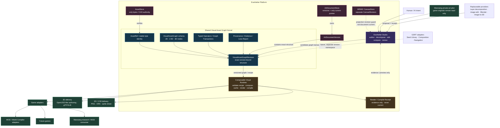

# EveAtelier Post-v0.5 Dual-Surface Future Roadmap

Date: 2026-09-14

Version: v0.1

Status: `PROPOSED / NOT_ADOPTED / REVIEW_REQUIRED`

Baseline: `main@118ed586630b98d55f5c09c84e97c57f4a4d37ba`

## 0. Purpose and authority

This document proposes the post-v0.5 product and runtime topology after reviewing:

- the implemented EveAtelier v0.2–v0.5 architecture;
- the Composable Visual Object Runtime research;
- the line-first structured 2D pipeline;
- the internal 2026-09 product/art/game/organization series;
- the separate GSRT v0.6–v0.8 research-runtime roadmap;
- the user's decision that the first real AI-art pilot remains the private Wanxiang
  character-art workflow.

Source documents are design evidence, not execution authority. This proposal does not
start a model, modify game files, adopt a new schema, create a second repository, merge,
release or deploy anything.

## 1. Decision summary

The recommended form is:

```text
one product platform
+ one canonical Visual Asset Graph
+ two independently deliverable surfaces
```

The two surfaces are:

1. **EveAtelier Studio** — authoring, decomposition, editing, comparison and human
   judgment;
2. **Composable Visual Runtime** — headless deterministic validation, composition,
   caching, rendering and delivery compilation.

This is not a 2D edition versus a 3D edition, and it is not a Lite/Pro fork. 2D, 2.5D
and 3D are subspaces of one canonical graph. The split follows lifecycle and deployment
responsibility:

```text
Authoring / experimentation / human review
!=
Deterministic runtime / game embedding / delivery compilation
```

## 2. Architecture diagram

Canonical Mermaid source:
[`eveatelier-post-v05-dual-surface-architecture-v0.1.mmd`](eveatelier-post-v05-dual-surface-architecture-v0.1.mmd)



## 3. Shared kernel versus the two surfaces

| Concern | Shared Visual Asset Graph Kernel | EveAtelier Studio | Composable Visual Runtime |
|---|---|---|---|
| Asset identity and hashes | imports `AssetRef`; owns no bytes | reads and registers through AssetStore | resolves and verifies through AssetStore |
| Node/edge/schema meaning | owns versioned contract | proposes transactions | validates and executes |
| Flat-image decomposition | records candidate shape | owns user/provider workflow | does not invent semantics |
| Layer/mask/line editing | defines targets | owns interaction and review | applies typed operations |
| Recipe/compatibility | defines contract | authors and previews | owns deterministic validation |
| Provider-native state | never canonical | adapter boundary only | adapter boundary only |
| Evaluation and evidence | defines references | displays and requests review | emits execution/compile receipts |
| Current document | ArtDocument authority | requests promotion | cannot self-promote |
| Game/MOD acceptance | not owned | not owned | supplies candidate delivery only |

The shared kernel must remain small enough that both surfaces can consume it without
sharing UI state, Provider process state, credentials or one mutable database.

### 3.1 Existing authority and revision invariants

The Visual Asset Graph extends the current ArtDocument component model; it does not
replace or compete with it.

```text
AssetStore
  = only image/graph-component byte and CAS authority

ArtDocumentStore
  = document/version metadata and only current-version pointer authority

VisualAssetGraphRevision
  = exact structure/component representation owned by one ArtDocumentVersion

MRMIC CanvasStore
  = Canvas projection and CanvasRevision authority only

Composable Runtime
  = validation, render and compile receipts only
```

Required identities remain separate:

```text
CanvasRevision
!= ArtDocumentVersion
!= VisualAssetGraphRevision
!= Provider execution receipt
!= Runtime render/compile receipt
```

A graph store may retain immutable graph revisions and lineage, but it cannot define an
independent graph-current pointer. Graph transactions and Runtime receipts create
candidate evidence only; changing ArtDocument current still requires the existing
evaluation, human-review and promotion gate.

## 4. Why a sister runtime is necessary

Studio and embedded runtime have different failure costs and release cadence:

- Studio needs rapid UI and Provider experimentation.
- A game runtime needs stable schemas, deterministic recipes, bounded resource use and
  minimal dependencies.
- Studio may call external layer-decomposition, image-editing, Blender or image-to-3D
  Providers. A shipped game must not inherit those applications as mandatory startup
  dependencies.
- Studio can retain unresolved semantic candidates. Runtime compilation must fail
  closed on illegal graphs, unresolved dependencies and unsupported capabilities.
- Public creator tooling may expose schemas, validators and a bounded runtime without
  exposing internal batch-production systems.

Therefore a distinct deliverable is warranted. A second full editor codebase is not.

## 5. Repository strategy

### Stage A — logical separation inside the current repository

Begin with explicit module boundaries:

```text
src/visual-asset-graph/       shared versioned contracts and graph store
src/composable-runtime/       headless recipe validation/render/compile
src/product-surface/          EveAtelier Studio application adapter
apps/workbench-ui/            human UI
src/adapters/                 Provider and delivery adapters
```

No source copy or second database is required merely to draw the boundary.

### Stage B — extract the sister repository only when warranted

Extraction requires all of:

1. a stable graph/recipe contract with conformance fixtures;
2. at least two real consumers or one external delivery consumer;
3. a demonstrated independent release/dependency need;
4. a clean package boundary with no Studio UI or private runtime dependency;
5. independent reconstruction and compatibility tests.

Until those triggers exist, two repositories would add coordination cost without adding
product value.

## 6. Version namespaces

EveAtelier and GSRT retain different version namespaces.

| EveAtelier | Product milestone | GSRT remains separate |
|---|---|---|
| v0.6 | Structured 2D Asset | GSRT v0.6 Seed Library |
| v0.7 | Visual Asset Graph + sister-runtime boundary | GSRT v0.7 Composition / Mutation |
| v0.8 | 3D-first Asset Compiler bridge | GSRT v0.8 Seed-Space Navigation |

An adapter may later attach a seed or factor reference to a graph node/recipe, but equal
minor-version numbers do not imply equal lifecycle, schema or release authority.

## 7. EveAtelier v0.6 — Structured 2D Asset

### 7.1 Goal

Turn a flat raster into a retained, recursively refinable and recomposable candidate
asset rather than regenerating the whole image for each edit.

```text
Flat AssetRef
-> LayerDecomposition capability
-> candidate layer graph
-> independent reconstruction/evaluation
-> human correction/review
-> promoted Structured ArtDocument version
```

### 7.2 First node and relation set

Initial node kinds:

```text
GroupNode
RasterNode
LineNode
MaskNode
MaterialNode
PaletteNode
DetailNode
EffectNode
```

Initial relations:

```text
PARENT_OF
COMPOSES_BEFORE
MASKS
CLIPS
OCCLUDES
DERIVED_FROM
SEMANTIC_ROLE
```

Shape, line, mask, material, palette and detail remain distinct. A missing or uncertain
semantic role stays explicit; Provider confidence cannot silently become canonical
truth.

### 7.3 Required operations

- register a decomposition request against an exact source AssetRef;
- retain Provider/model/configuration receipt without making it canonical meaning;
- stage variable-count RGBA layers as candidates;
- recursively decompose one selected node without replacing its parent history;
- move, resize, recolor or hide one node while protecting non-target nodes;
- deterministically recompose at the declared graph revision;
- bind every graph revision to one exact ArtDocumentVersion and reject stale/mismatched
  document or Canvas revision guards;
- reconcile an external edit as a new candidate transaction;
- export PNG and ORA plus a loss/preservation report.

### 7.4 Validation

Required evidence remains multidimensional:

```text
source and recomposition dimensions
alpha coverage
pixel/perceptual reconstruction delta
edge contamination
layer isolation / leakage
occlusion order
target edit effect
protected-node drift
human semantic correction
```

No single overall score can self-promote the graph.

Required negative controls:

- a graph revision bound to the wrong ArtDocumentVersion is rejected;
- a graph transaction or decomposition receipt cannot modify document current;
- a stale CanvasRevision rejects projection/action but does not alter document or graph
  history;
- schema/store inspection finds no independent graph-current authority.

## 8. EveAtelier v0.7 — Visual Asset Graph and Composable Runtime

### 8.1 Goal

Stabilize the shared protocol and prove the sister-runtime boundary without creating a
second editor.

Required runtime pieces:

- versioned `VisualAssetGraph` and graph transaction;
- deterministic `VisualRecipe`;
- explicit slot/socket, compatibility and conflict rules;
- graph revision and input AssetRef guards;
- deterministic composition and cache keys;
- runtime capability declaration;
- render/compile receipt;
- lossy-export report with preserved, dropped, baked and externalized features;
- game-adapter interface and conformance pack.

The first proof remains 2D/2.5D. A graph that can only render one hard-coded character
does not close v0.7.

v0.7 closure additionally requires a forged Runtime receipt and a valid render receipt
to produce the same zero change to ArtDocument current; only a separately authorized
promotion event may advance current.

## 9. EveAtelier v0.8 — 3D-first Asset Compiler bridge

### 9.1 Goal

Extend node kinds and Provider boundaries without building an AI Blender clone.

Candidate 3D nodes:

```text
MeshNode
MaterialNode
TextureNode
SkeletonNode
AnimationNode
ColliderNode
PhysicsNode
CameraNode
LightNode
```

Candidate flow:

```text
2D structured reference
-> image-to-3D proposal
-> mesh/material candidates
-> repair / retopology / UV
-> rig / skin / physics candidates
-> validation and human review
-> 2D, 2.5D or 3D projection
-> delivery compile
```

Blender and image-to-3D systems are replaceable execution Providers. OpenUSD-like
authoring and glTF/GLB delivery remain adapter choices subject to later license and
conformance review.

## 10. Wanxiang-first private production pilot

Wanxiang character art remains the first real AI-art consumer because it provides a
concrete pain point, existing source/reference evidence and a real MOD/game context.

The pilot is deliberately asymmetric:

| EveAtelier art/software role | Wanxiang game/research role |
|---|---|
| owns decomposition/graph/edit/evaluation tools | owns read-only game identity and import constraints |
| produces candidate structured assets | identifies exact consumer slot/build/scale |
| retains Provider receipts and human review | validates game-side appearance/import separately |
| never writes installed game files | never changes EveAtelier canonical contracts unilaterally |

Initial private input may reuse the already-approved Character Remaster pack. Additional
characters require an exact game-side identity, source hash and user-selected scope.
Private authorization does not become `RIGHTS_CLEAR_REAL`; source, references, generated
layers and outputs remain outside Git and public distribution.

The prior exclusion of the unrelated “清涼服裝” workshop image remains in force. Its
absence must not be interpreted as a universal negative rule about exposure or costume.

## 11. Wanxiang pilot handoff contract

Before a real decomposition/generation run, the game-side task supplies:

- BuildID and stable character/asset identity;
- exact source hash and observed dimensions/alpha;
- expected in-game slot, scale, pivot and format when known;
- whether the output is portrait, sprite, UI, cut-in or another use;
- known import/MOD constraints and what remains unmeasured;
- rights class and private-local authorization reference.

EveAtelier later returns:

- source-bound graph candidate and node AssetRefs;
- reconstruction image and graph/recipe digest;
- decomposition and edit Provider receipts;
- layer-isolation, reconstruction and protected-drift evidence;
- human review and warnings;
- export package plus explicit loss report;
- `NOT_MEASURED` for game import until the Wanxiang task performs it.

Receipt, visual acceptance, game import acceptance and MOD release remain separate.

## 12. Relationship to GSRT

GSRT is a future generative-state substrate, not the Visual Asset Graph itself.

Potential later bindings:

```text
Graph node / recipe
-> SeedRef / FactorRef
-> GSRT retrieval, legal composition or navigation
-> Provider proposal
-> graph candidate transaction
```

GSRT cannot mutate ArtDocument current, activate a visual concept, approve a graph,
select a game release or replace exact source archives.

## 13. Downstream game and MOD boundaries

The internal world/MOD documents are downstream architecture inputs, not reasons to put
a World Compiler, economy, quest system or MOD marketplace into the EveAtelier hot path.

EveAtelier and the sister runtime should expose stable asset/recipe/compiler contracts.
Game projects own world rules, save compatibility and playable integration. A future MOD
SDK may consume the public-safe runtime and validators after its own sandbox, permission,
migration and distribution design.

## 14. Adoption sequence

```text
1. Review this proposal and the user's new theory.
2. Freeze the v0.6 Structured 2D slice and non-goals.
3. Implement v0.6 on an isolated feature branch with synthetic regression first.
4. Run the Wanxiang private pilot through the same candidate/evidence gates.
5. Promote v0.6 only after independent closure review.
6. Begin v0.7 shared graph/runtime conformance work.
7. Extract a sister repository only when the Stage B triggers are observed.
8. Start v0.8 3D work only after the graph/runtime boundary is stable.
```

## 15. Explicit non-goals for this proposal

- no second full editor or duplicated Studio state;
- no forced 2D/3D product fork;
- no Photoshop, Krita or Blender feature parity;
- no automatic semantic truth from layer-decomposition output;
- no game-installation mutation;
- no public redistribution of Wanxiang or private generated assets;
- no MOD execution, marketplace or world-generation implementation;
- no GSRT, SEDB, ISQL or vector-database choice forced into v0.6;
- no Provider/model/pricing claim adopted from a dated internal document without fresh
  independent verification.

## 16. Source crosswalk

| Source | Used proposition |
|---|---|
| EveAtelier v0.2–v0.5 | typed operators, persistent documents, evidence, human authority |
| Line-first Composable Visual research | Shape/Line/Mask separation and deterministic recipes |
| Structured 2D internal paper | recursive layer decomposition and node-targeted editing |
| 3D-first internal paper | presentation/authoring separation and Provider-based asset compiler |
| Unified Visual Asset Graph paper | one graph with multiple views and delivery compilers |
| Game/World/MOD papers | downstream IDs, adapters, compatibility and distribution boundaries |
| GSRT v0.6–v0.8 | separate generative memory/composition/navigation adapter roadmap |

Internal-series archive intake SHA-256:

```text
F8219B9C73F54A35DFD9CEE661154D63A6813DB8E51420BA5A77AA404F0F644C
```

## 17. Open decisions

This proposal deliberately leaves three user decisions open:

1. whether the new theory changes the v0.6 node/edge model;
2. whether the first new Wanxiang pilot character remains the existing Character
   Remaster source or another specifically selected character;
3. the product-facing name of the future Composable Visual Runtime deliverable.

Until those are resolved, this document remains a reviewable roadmap candidate rather
than adopted implementation authority.
